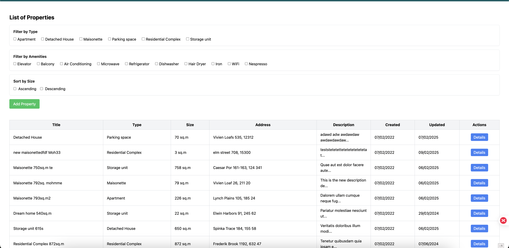
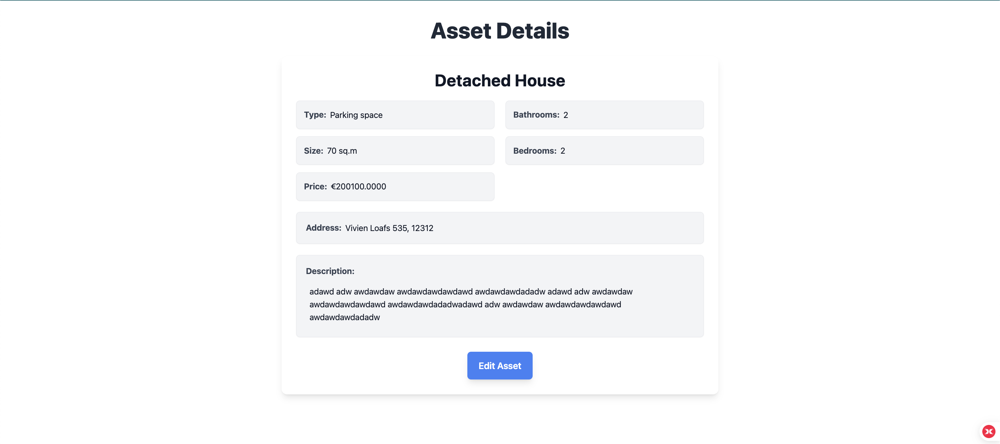
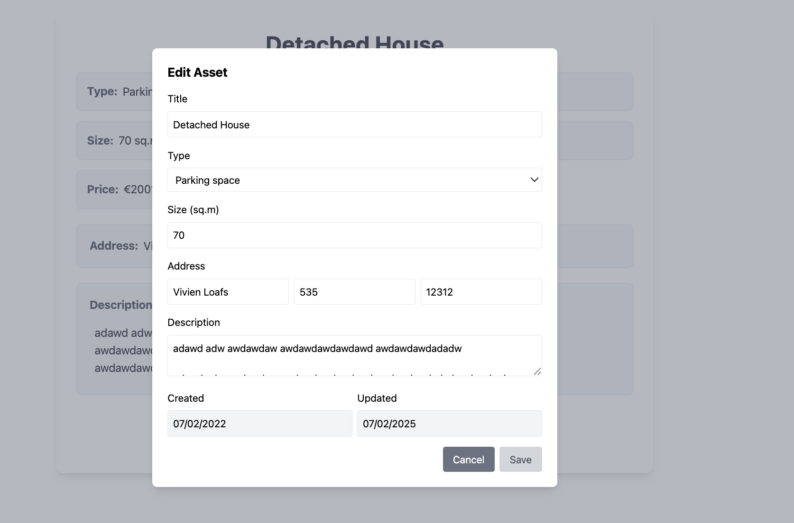
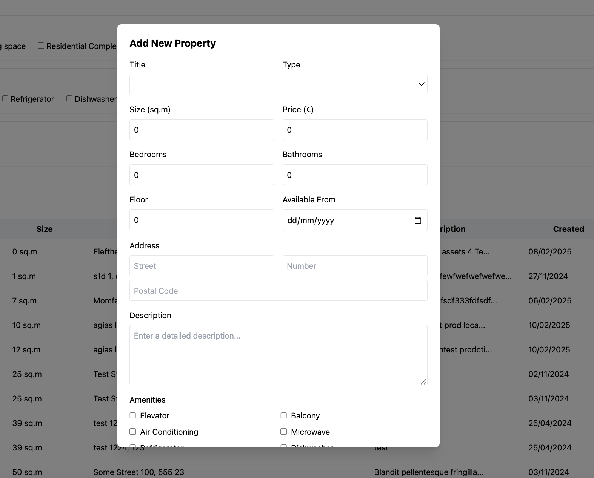

# 🏡 Prosperty Amazing App 🚀

Welcome to **Prosperty Amazing App** – the **ultimate** real estate management tool!  
Want to **browse, filter, and manage** properties like a boss? This app has got you covered! 🎉

🌍 **Live Demo:** [theprosportyamazingapp.netlify.app](https://theprosportyamazingapp.netlify.app/)

---

## 🎯 Features

✅ **View** a list of properties with a sleek design  
✅ **Filter** properties by type, amenities, size, and more  
✅ **Add** new properties using an intuitive modal  
✅ **Edit** properties with a smooth and responsive UI  
✅ **Fast & Modern** - Built with Vue 3 + TailwindCSS

---

## 📸 Screenshots

![Property List] 
_The clean and intuitive property list view._

  
_Property details view._

  
_Easily edit property details in a responsive modal._

  
_Easily Add property in a responsive modal._

---

## 🚀 Tech Stack

- 🟢 **Vue 3** – Modern frontend framework
- 🎨 **Tailwind CSS** – Beautiful, fast, and responsive styling
- 📦 **Pinia** – Easy state management
- 🌍 **Vue Router** – Navigation made simple
- ✅ **Jest + Vue Test Utils** – Strong test coverage

---

## 🛠 Setup & Installation

1️⃣ **Clone the repository:**

```sh
git clone https://github.com/mohammedAlabdali96/Prosperty.git
cd Prosperty
```

2️⃣ **Install dependencies:**


```sh
yarn install

```


sh
Copy
Edit


3️⃣ **Run the app locally:**


```sh
yarn run dev

```

4️⃣ **Run test**


```sh
yarn test

```
